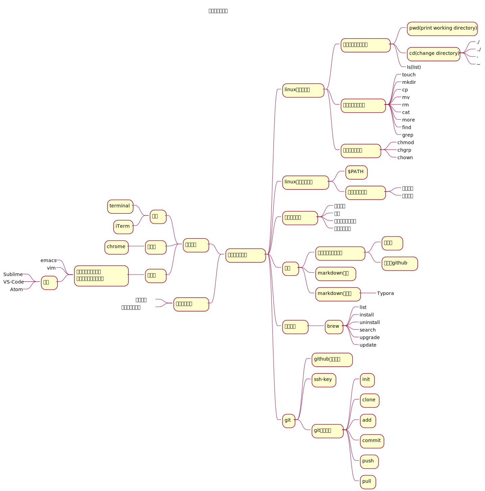
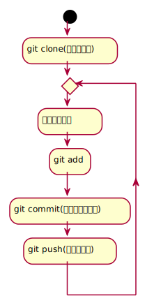

# Table of Contents

1.  [学习路线](#orge7eea5d)
2.  [预备课必备知识](#org25bd5d8)
    1.  [命令行操作](#orgff17d76)
        1.  [linux文件和目录](#org3d7a11c)
        2.  [快捷键](#orgfbf986d)
        3.  [其他重要命令](#org43819ec)
    2.  [Mac下的软件管理](#orgf419166)
        1.  [brew](#org913bee3)
        2.  [直接下载安装包（dmg文件）](#org624b9fc)
    3.  [编辑器](#orgdbcd4b1)
    4.  [如何做笔记](#org4ec9b4c)
        1.  [有道云笔记](#org96126fa)
        2.  [markdown语法](#org2decadf)
    5.  [git](#org1a3266f)
        1.  [安装](#org5afcae1)
        2.  [github的使用](#org0cb3b00)
        3.  [注意事项](#org87b9692)

# 学习路线

# 预备课必备知识

[半圆的wiki参考](https://wiki.banyuan.club/pages/viewpage.action?pageId=3047612)

## 命令行操作

> **重要**
> 使用 `Tab` 键可以进行补全，加快你的操作。

### linux文件和目录

[文件权限与目录配置](http://cn.linux.vbird.org/linux_basic/0210filepermission.php)

[文件与目录管理](http://cn.linux.vbird.org/linux_basic/0220filemanager.php)

1.  Home目录是什么？
2.  `.` 和 `..` 以及 ~ 是什么？
3.  什么是隐藏文件

<table border="2" cellspacing="0" cellpadding="6" rules="groups" frame="hsides">

<colgroup>
<col  class="org-left" />

<col  class="org-left" />
</colgroup>
<thead>
<tr>
<th scope="col" class="org-left">文件操作命令</th>
<th scope="col" class="org-left">作用</th>
</tr>
</thead>

<tbody>
<tr>
<td class="org-left">ls</td>
<td class="org-left">查看目录下的文件和文件夹</td>
</tr>

<tr>
<td class="org-left">ls -l</td>
<td class="org-left">long选项，显示更多的信息</td>
</tr>

<tr>
<td class="org-left">ls -a</td>
<td class="org-left">显示隐藏文件和文件夹</td>
</tr>

<tr>
<td class="org-left">cd 文件夹</td>
<td class="org-left">change dir（切换工作目录）</td>
</tr>

<tr>
<td class="org-left">cd ..</td>
<td class="org-left">切换到父目录</td>
</tr>

<tr>
<td class="org-left">cd</td>
<td class="org-left">不带参数切换到Home目录</td>
</tr>

<tr>
<td class="org-left">cd -</td>
<td class="org-left">切换到之前的工作目录</td>
</tr>

<tr>
<td class="org-left">pwd</td>
<td class="org-left">print work dir（打印当前的工作目录）</td>
</tr>

<tr>
<td class="org-left">mkdir</td>
<td class="org-left">创建一个目录</td>
</tr>

<tr>
<td class="org-left">mkdir -p</td>
<td class="org-left">创建多层目录</td>
</tr>

<tr>
<td class="org-left">rm</td>
<td class="org-left">remove(删除普通文件）</td>
</tr>

<tr>
<td class="org-left">rm -rf</td>
<td class="org-left">删除文件夹及其下面的所有文件</td>
</tr>

<tr>
<td class="org-left">cp</td>
<td class="org-left">copy(拷贝文件)</td>
</tr>

<tr>
<td class="org-left">cp -r</td>
<td class="org-left">拷贝文件夹</td>
</tr>

<tr>
<td class="org-left">mv</td>
<td class="org-left">move重命名文件/文件夹或是移动文件/文件夹</td>
</tr>

<tr>
<td class="org-left">touch</td>
<td class="org-left">创建一个空文件</td>
</tr>
</tbody>
</table>

### 快捷键

<table border="2" cellspacing="0" cellpadding="6" rules="groups" frame="hsides">

<colgroup>
<col  class="org-left" />

<col  class="org-left" />
</colgroup>
<thead>
<tr>
<th scope="col" class="org-left">按键</th>
<th scope="col" class="org-left">作用</th>
</tr>
</thead>

<tbody>
<tr>
<td class="org-left">C-a</td>
<td class="org-left">光标移动到行首</td>
</tr>

<tr>
<td class="org-left">C-e</td>
<td class="org-left">光标移动到行尾</td>
</tr>

<tr>
<td class="org-left">C-f</td>
<td class="org-left">光标右移一个字符</td>
</tr>

<tr>
<td class="org-left">C-b</td>
<td class="org-left">光标左移一个字符</td>
</tr>

<tr>
<td class="org-left">M-f</td>
<td class="org-left">光标右移一个单词</td>
</tr>

<tr>
<td class="org-left">M-b</td>
<td class="org-left">光标左移一个单词</td>
</tr>

<tr>
<td class="org-left">C-d</td>
<td class="org-left">删除光标下的字符</td>
</tr>

<tr>
<td class="org-left">M-d</td>
<td class="org-left">删除光标右边的单词</td>
</tr>

<tr>
<td class="org-left">C-w</td>
<td class="org-left">删除光标左边的单词</td>
</tr>

<tr>
<td class="org-left">C-k</td>
<td class="org-left">删除光标右边的所有内容</td>
</tr>

<tr>
<td class="org-left">C-u</td>
<td class="org-left">删除整行内容</td>
</tr>

<tr>
<td class="org-left">C-p</td>
<td class="org-left">上一条执行的命令</td>
</tr>

<tr>
<td class="org-left">C-n</td>
<td class="org-left">下一条执行的命令（需要先执行C-p才可使用）</td>
</tr>

<tr>
<td class="org-left">C-r</td>
<td class="org-left">搜索之前执行的命令</td>
</tr>
</tbody>
</table>

### 其他重要命令

1.  `history`
    查看历史命令记录
2.  `cat`
    查看文本文件内容
3.  `grep`
    过滤内容

## Mac下的软件管理

### brew

1.  安装

    [参考](https://wiki.banyuan.club/pages/viewpage.action?pageId=13700577)

2.  速度慢&#x2014;国内镜像修改

    [参考](https://wiki.banyuan.club/pages/viewpage.action?pageId=13700577)

3.  常用命令

    <table border="2" cellspacing="0" cellpadding="6" rules="groups" frame="hsides">
    
    
    <colgroup>
    <col  class="org-left" />
    
    <col  class="org-left" />
    </colgroup>
    <thead>
    <tr>
    <th scope="col" class="org-left">命令</th>
    <th scope="col" class="org-left">作用</th>
    </tr>
    </thead>
    
    <tbody>
    <tr>
    <td class="org-left">brew list</td>
    <td class="org-left">查看已经安装的软件</td>
    </tr>
    
    
    <tr>
    <td class="org-left">brew install</td>
    <td class="org-left">安装软件</td>
    </tr>
    
    
    <tr>
    <td class="org-left">brew uninstall</td>
    <td class="org-left">卸载软件</td>
    </tr>
    
    
    <tr>
    <td class="org-left">brew search</td>
    <td class="org-left">查询可供安装的软件</td>
    </tr>
    </tbody>
    </table>

### 直接下载安装包（dmg文件）

## 编辑器

选择一个适合你的编辑器

所有编辑相关的操作都尽量只在编辑器中完成，不需要鼠标和触摸板的操作

-   sublime
    
    <https://www.sublimetext.com/>

-   Atom
    
    <https://atom.io/>

-   Visual Studio Code （VS-Code）
    
    <https://code.visualstudio.com/>

-   vim
-   emacs

## 如何做笔记

<https://wiki.banyuan.club/pages/viewpage.action?pageId=3052629>

### 有道云笔记

### markdown语法

## git

### 安装

参看下面的教程：

<https://wiki.banyuan.club/pages/viewpage.action?pageId=13700569>

### github的使用

1.  账号申请(github网站操作)
2.  配置ssh-key（github网站操作)
3.  创建项目（github网站操作）
4.  项目管理(本机操作)
    
    
    
    1.  git clone
    2.  git add
    3.  git commit
    4.  git push

### 注意事项

1.  确认你的 `home` 目录下没有 `.git` 文件夹
    
        cd ~
        ls -la | grep "\.git"
    
    如果这条命令

